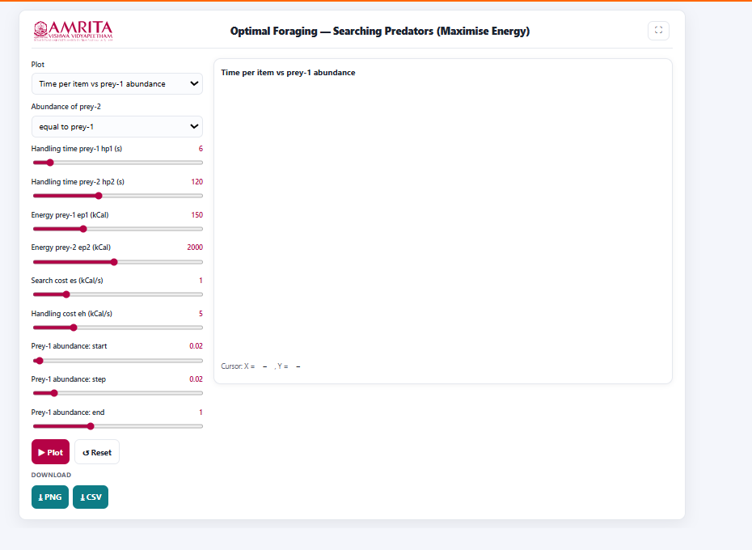
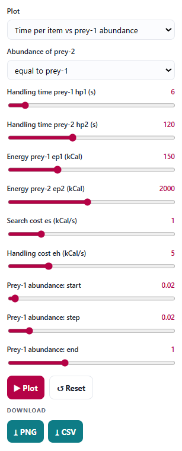
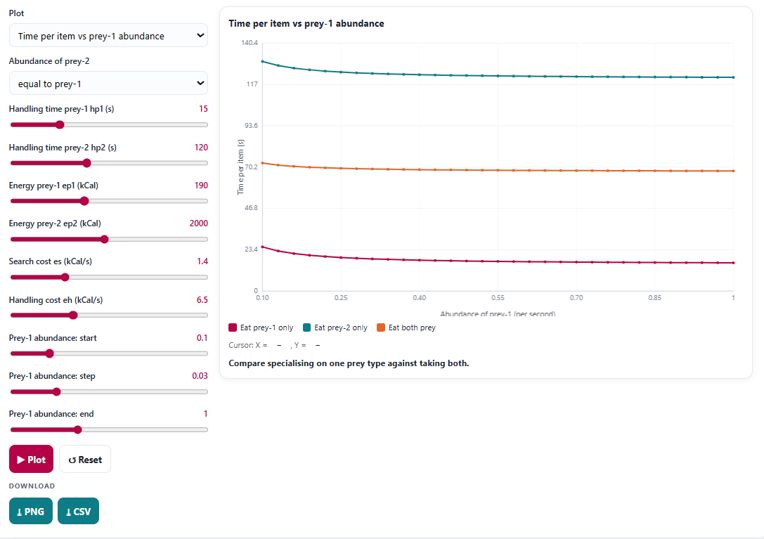

### Procedure

1. The simulator enables users to investigate the optimal prey selection strategy of a searching predator based on energetic costs and benefits. Users can configure prey characteristics, handling and searching costs, prey abundance, and generate graphical outputs to evaluate how different ecological conditions influence energy-maximizing foraging decisions.
 

 
&nbsp;

2. Select the desired graph from the Plot drop-down menu. The simulator provides different graphical analyses for evaluating predator foraging behaviour. Select the graph appropriate for the intended analysis. 

 
&nbsp;

3. Specify the abundance of Prey-2 using the corresponding drop-down menu. This parameter defines the relative abundance of the second prey type with respect to Prey-1. 

&nbsp;

4. Adjust the handling time for Prey-1 (hp₁) using the corresponding slider. This parameter represents the time required by the predator to capture, process, and consume an individual of Prey-1. 

&nbsp;

5. Adjust the handling time for Prey-2 (hp₂) using the corresponding slider. This parameter specifies the handling time associated with Prey-2. 

&nbsp;

6. Specify the energetic value of Prey-1 (ep₁) using the corresponding slider. This parameter represents the amount of energy obtained by the predator from consuming an individual of Prey-1. 

&nbsp;

7. Specify the energetic value of Prey-2 (ep₂) using the corresponding slider. This parameter defines the energy obtained from consuming an individual of Prey-2. 

&nbsp;

8. Adjust the searching cost (es) using the corresponding slider. This parameter represents the energetic cost incurred by the predator while searching for prey. 

&nbsp;

9. Specify the handling cost (eh) using the corresponding slider. This parameter represents the energetic expenditure associated with capturing, processing, and consuming prey. 

&nbsp;

10. Specify the starting abundance of Prey-1 using the Prey-1 abundance: start slider. This parameter defines the lower limit of the prey abundance range used in the analysis. 

&nbsp;

11. Set the increment in Prey-1 abundance using the Prey-1 abundance: step slider. This parameter determines the interval between successive prey abundance values during graph generation.

&nbsp;

12. Specify the ending abundance of Prey-1 using the Prey-1 abundance: end slider. This parameter defines the upper limit of the prey abundance range considered in the simulation. 

&nbsp;

13. After configuring all simulation parameters, click the Plot button to generate the selected graphical output.

 
&nbsp;

14. Observe the graph displayed in the visualization panel. The graph illustrates the variation in time per prey item with changes in the abundance of Prey-1 under different prey selection strategies. 

&nbsp;

15. Interpret the X-axis (Abundance of Prey-1) to examine the availability of Prey-1 within the habitat. 

&nbsp;

16. Interpret the Y-axis (Time per Item, s) to determine the average time required by the predator to obtain a single prey item under each foraging strategy. 

&nbsp;

17. Use the graph legend to distinguish the three foraging strategies represented in the graph: 
* Eat Prey-1 only 
* Eat Prey-2 only 
* Eat both prey types 

&nbsp;

18. Compare the curves to determine how the time required to capture prey varies with increasing abundance of Prey-1 for each foraging strategy. 

&nbsp;

19. Identify the strategy that produces the lowest time per prey item over the selected range of prey abundance. A lower time per item indicates a more efficient foraging strategy under the specified ecological conditions. 

&nbsp;

20. Read the interpretation message displayed below the graph. This message summarizes the comparison between specializing on a single prey type and consuming both prey types. 

&nbsp;

21. Move the cursor over the graph, if required, to display the corresponding coordinate values shown beneath the graph. These values indicate the time per prey item at a specific Prey-1 abundance. 

&nbsp;

22. Modify one or more simulation parameters, such as prey abundance, prey energy content, handling time, searching cost, or handling cost, and generate the graph again to investigate how these factors influence the efficiency of different foraging strategies. 

&nbsp;

23. If required, click the Reset button to restore the default parameter values before performing another simulation. 

&nbsp;

24. Download the graphical output by clicking the PNG button or export the numerical simulation data by clicking the CSV button for further analysis and comparison. 

&nbsp;

25. Repeat the above procedure using different parameter combinations to compare prey selection strategies under varying ecological conditions and determine the conditions.

&nbsp;

