&nbsp;

Population density of predators mainly depends upon their food. That means predators who hunt more efficiently will get more than their actual share and thus can produce many offspring than others (It includes finding /catching /killing their prey). It is evident that the hunting behaviour of organisms is more efficient with regard to energy or time expended in hunting. This area of study in population ecology is called optimal foraging theory. Optimal foraging theory was first proposed by Robert MacArthur, J M Emlen, and Eric Pianka in 1966. Optimal foraging illustrates the organisms forage in such a way as to maximize their net energy intake per unit time.  The first assumption of the optimal foraging theory is natural selection will only favour behaviour that maximizes energy return.

&nbsp;

#### Optimal Foraging Theory and Patterns of Foraging

Optimal foraging theory helps biologist to understand the factors determining a consumer’s operation range of food types. Predators are categories into two searching and sit-and-wait. A searching predator moves throughout its habitat and find its prey. A sit-and-wait predator waits for its prey to near its point of observation. That is some predators attack their prey from ambush, whereas others usually hunt while on the move. Pianka (1966) termed these two modes of foraging the "sit-and-wait” and "widely-foraging" respectively. There is striking difference in foraging pattern between these two groups. Foraging mode is an important characterizing trait of predators and may correlate with behavioural, ecological, physiological, and morphological characteristics. It is clear that the natural consequential impact on optimal foraging theory and competitive relationships among species (Magnusson et al. 1985; McLaughlin 1989; Perry et al. 1990; Pietruszka 1986).

There are some conditions required to support these two modes of foraging. A sit-and-wait strategy is mostly relying on moving preys or high prey mobility and the prey density must be relatively high. In order to favour the sit-and-wait tactic, predator’s energy requirements must be low. Whereas searching predators encounter and consume non-moving types of prey population. The success of widely foraging pattern of ‘searchers’ is also influenced by prey density and prey mobility along with the predator's energetic requirements. Generally it should be higher than those of sit-and-wait predators. However the searching abilities of the predator and the spatial distribution of its prey are paramount. The sit-and-wait foraging mode is less common during periods of prey scarcity than the widely-foraging pattern.

It has been studied  that there are some general correlates between these foraging modes in the case of desert lizards. Huey and Pianka (1981) summarize many of these ecological correlates of foraging mode.

&nbsp;

#### A Case of Searching Predators that Maximize Energy

As described earlier, there are two general categories of predators: searching and sit-and-wait. In this exercise we will study the behaviour of searching predator whose optimal foraging strategy is to maximize the energy that it gains during each foraging course. A predator with no particular danger or other duties is likely to have a foraging strategy that maximizes energy return rather than minimizing the foraging time. Such a predator should prefer a prey based on three aspects: (i) the energy content of the animal, (ii) the energy spent in searching for the animal, and (iii) the energy spent in capturing and eating it.

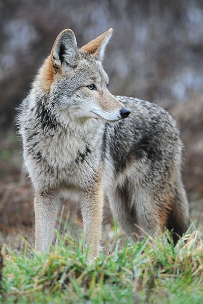
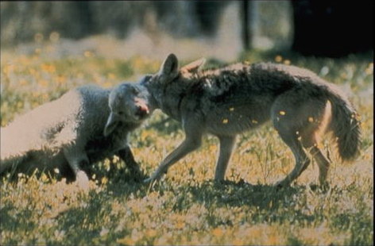

Image source: http://en.wikipedia.org

 
&nbsp;

For example consider a coyote, which moves across the forest for searching its prey (deer, rabbit, mice etc). The energy content of each of these preys can be quantified in a laboratory. Here, let us assume that a rabbit contains more kilocalories than that of a deer. The energy spent in searching one of these animals is

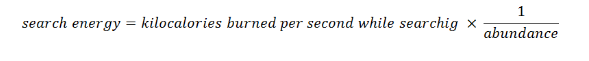

&nbsp;

The search time is inversely related to prey abundance,i.e.,

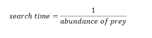

In this exercise, the abundance is measured as the occurrence per second. That is the more abundant the prey, the more frequent it is encountered.

The handling energy is the energy expended in capturing and killing the prey and it is given by

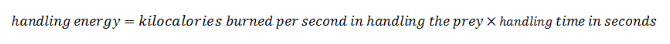

&nbsp;

Combining all these three factors such as energy content, search energy, and handling energy together, we get another equation, which is the energy intake per prey item. It is given by:

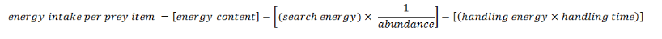

&nbsp;

That is, the energy intake from prey- 1 (for e.g. when eating only a rabbit) is given by

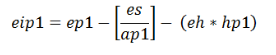

Similarly the energy gain from prey-2 (for e.g. when eating only a deer) is given by

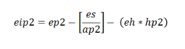

Where,

**ep1** is the energy content of prey-1, 

**ep2** is the energy content of prey-2, 

**es** is the search energy, 

**eh** is the handling energy, 

**hp1** is the handling time for prey-1 , 

**hp2** is the handling time for prey-2 , 

**ap1** is the abundance of prey-1, 

**ap2** is the abundance of prey-2.

&nbsp;

The search energy, abundance, handling energy and handling time are all expressed in terms of seconds.

Now we can consider the energy intake for the strategy of taking both prey-1 and prey-2. That is the predator should encounter either prey-1 or prey-2. In this case the probability of attacking any one of the prey depends on its abundance relative to other.

That is, the probability of a prey-1 is being encountered is,

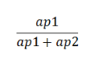

And that of prey-2 is given by,

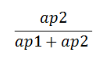

&nbsp;

Therefore, for a predator that is foraging on both prey-1 and prey-2, the average energy content per prey item is given by

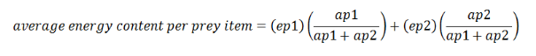

&nbsp;

And the energetic cost of searching is given by,

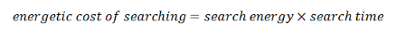

&nbsp;

The energetic cost of handling is given by,

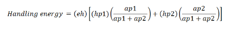

&nbsp;

We will get the equation for net energy gain when all these energetic costs and benefits are combined together. That is, the net energy gain when foraging on both prey-1 and prey-2 is given by the following formula.

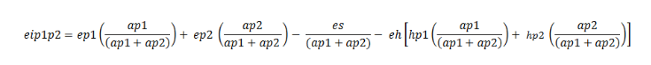

Where, **eip1p2** is the net energy gain from prey-1 and prey-2 .

&nbsp;

The total time (finding, catching and killing time) is inversely related to prey abundance and the time it takes to catch and kill is directly related to its handling time.

The total time for a predator hunting only prey-1 is thus

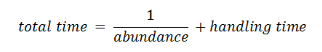

or

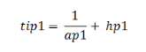

&nbsp;

Therefore, the total time for a predator hunting both prey-1 and prey-2 is given by

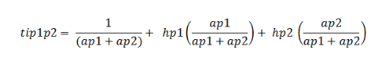

&nbsp;
